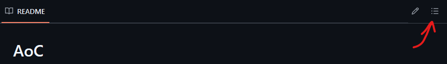

# AoC

My attempts for Advent of Code :3!  

Filter by year

  
## 2015: Golang 

| Day | Part 1 | Part 2 |
|:----|:-------|:-------|
| 1   | ✅      | ✅      |
| 2   | ✅      | ✅      |
| 3   | ✅      | ✅      |
| 4   | ✅      | ✅      |
| 5   | ✅      | ✅      |
| 6   | ✅      | ✅      |
| 7   | ✅      | ✅      |
| 8   | ✅      | ✅      |
| 9   | ❌      | ❌      |
| 10  | ✅      | ✅      |
| 11  | ✅      | ✅      |
| 12  | ✅      | ✅      |
| 13  | ❌      | ❌      |
| 14  | ✅      | ✅      |
| 15  | ❌      | ❌      |
| 16  | ✅      | ✅      |
| 17  | ❌      | ❌      |
| 18  | ❌      | ❌      |
| 19  | ❌      | ❌      |
| 20  | ❌      | ❌      |
| 21  | ❌      | ❌      |
| 22  | ❌      | ❌      |
| 23  | ❌      | ❌      |
| 24  | ❌      | ❌      |
| 25  | ❌      | ❌      |

## 2016: Python

| Day     | Part 1 | Part 2 |
|:--------|:-------|:-------|
| 1       | ✅      | ✅      |
| 2 in go | ✅      | ✅      |
| 3       | ✅      | ✅      |
| 4       | ✅      | ✅      |
| 5       | ✅      | ✅      |
| 6       | ✅      | ✅      |
| 7       | ✅      | ✅      |
| 8       | ✅      | ✅      |
| 9       | ✅      | ✅      |
| 10      | ✅      | ✅      |
| 11      | ❌      | ❌      |
| 12      | ✅      | ✅      |
| 13      | ❌      | ❌      |
| 14      | ❌      | ❌      |
| 15      | ❌      | ❌      |
| 16      | ❌      | ❌      |
| 17      | ❌      | ❌      |
| 18      | ❌      | ❌      |
| 19      | ❌      | ❌      |
| 20      | ❌      | ❌      |
| 21      | ❌      | ❌      |
| 22      | ❌      | ❌      |
| 23      | ❌      | ❌      |
| 24      | ❌      | ❌      |
| 25      | ❌      | ❌      |

## 2017: F#, this fucking sucks balls

| Day | Part 1 | Part 2 |
|:----|:-------|:-------|
| 1   | ✅      | ✅      |
| 2   | ✅      | ✅      |
| 3   | ✅      | ❌      |
| 4   | ✅      | ❌      |
| 5   | ❌      | ❌      |
| 6   | ❌      | ❌      |
| 7   | ❌      | ❌      |
| 8   | ❌      | ❌      |
| 9   | ❌      | ❌      |
| 10  | ❌      | ❌      |
| 11  | ❌      | ❌      |
| 12  | ❌      | ❌      |
| 13  | ❌      | ❌      |
| 14  | ❌      | ❌      |
| 15  | ❌      | ❌      |
| 16  | ❌      | ❌      |
| 17  | ❌      | ❌      |
| 18  | ❌      | ❌      |
| 19  | ❌      | ❌      |
| 20  | ❌      | ❌      |
| 21  | ❌      | ❌      |
| 22  | ❌      | ❌      |
| 23  | ❌      | ❌      |
| 24  | ❌      | ❌      |
| 25  | ❌      | ❌      |

## 2018: Rust/Python/C#/C/F#/Haskell/

| Day | Part 1 | Part 2 |
|:----|:-------|:-------|
| 1   | ❌      | ❌      |
| 2   | ❌      | ❌      |
| 3   | ❌      | ❌      |
| 4   | ❌      | ❌      |
| 5   | ❌      | ❌      |
| 6   | ❌      | ❌      |
| 7   | ❌      | ❌      |
| 8   | ❌      | ❌      |
| 9   | ❌      | ❌      |
| 10  | ❌      | ❌      |
| 11  | ❌      | ❌      |
| 12  | ❌      | ❌      |
| 13  | ❌      | ❌      |
| 14  | ❌      | ❌      |
| 15  | ❌      | ❌      |
| 16  | ❌      | ❌      |
| 17  | ❌      | ❌      |
| 18  | ❌      | ❌      |
| 19  | ❌      | ❌      |
| 20  | ❌      | ❌      |
| 21  | ❌      | ❌      |
| 22  | ❌      | ❌      |
| 23  | ❌      | ❌      |
| 24  | ❌      | ❌      |
| 25  | ❌      | ❌      |

## 2019: Rust/Python/C#/C/F#/Haskell/

| Day | Part 1 | Part 2 |
|:----|:-------|:-------|
| 1   | ❌      | ❌      |
| 2   | ❌      | ❌      |
| 3   | ❌      | ❌      |
| 4   | ❌      | ❌      |
| 5   | ❌      | ❌      |
| 6   | ❌      | ❌      |
| 7   | ❌      | ❌      |
| 8   | ❌      | ❌      |
| 9   | ❌      | ❌      |
| 10  | ❌      | ❌      |
| 11  | ❌      | ❌      |
| 12  | ❌      | ❌      |
| 13  | ❌      | ❌      |
| 14  | ❌      | ❌      |
| 15  | ❌      | ❌      |
| 16  | ❌      | ❌      |
| 17  | ❌      | ❌      |
| 18  | ❌      | ❌      |
| 19  | ❌      | ❌      |
| 20  | ❌      | ❌      |
| 21  | ❌      | ❌      |
| 22  | ❌      | ❌      |
| 23  | ❌      | ❌      |
| 24  | ❌      | ❌      |
| 25  | ❌      | ❌      |

## 2020: Rust/Python/C#/C/F#/Haskell/

| Day | Part 1 | Part 2 |
|:----|:-------|:-------|
| 1   | ❌      | ❌      |
| 2   | ❌      | ❌      |
| 3   | ❌      | ❌      |
| 4   | ❌      | ❌      |
| 5   | ❌      | ❌      |
| 6   | ❌      | ❌      |
| 7   | ❌      | ❌      |
| 8   | ❌      | ❌      |
| 9   | ❌      | ❌      |
| 10  | ❌      | ❌      |
| 11  | ❌      | ❌      |
| 12  | ❌      | ❌      |
| 13  | ❌      | ❌      |
| 14  | ❌      | ❌      |
| 15  | ❌      | ❌      |
| 16  | ❌      | ❌      |
| 17  | ❌      | ❌      |
| 18  | ❌      | ❌      |
| 19  | ❌      | ❌      |
| 20  | ❌      | ❌      |
| 21  | ❌      | ❌      |
| 22  | ❌      | ❌      |
| 23  | ❌      | ❌      |
| 24  | ❌      | ❌      |
| 25  | ❌      | ❌      |

## 2021: Rust/Python/C#/C/F#/Haskell/

| Day | Part 1 | Part 2 |
|:----|:-------|:-------|
| 1   | ❌      | ❌      |
| 2   | ❌      | ❌      |
| 3   | ❌      | ❌      |
| 4   | ❌      | ❌      |
| 5   | ❌      | ❌      |
| 6   | ❌      | ❌      |
| 7   | ❌      | ❌      |
| 8   | ❌      | ❌      |
| 9   | ❌      | ❌      |
| 10  | ❌      | ❌      |
| 11  | ❌      | ❌      |
| 12  | ❌      | ❌      |
| 13  | ❌      | ❌      |
| 14  | ❌      | ❌      |
| 15  | ❌      | ❌      |
| 16  | ❌      | ❌      |
| 17  | ❌      | ❌      |
| 18  | ❌      | ❌      |
| 19  | ❌      | ❌      |
| 20  | ❌      | ❌      |
| 21  | ❌      | ❌      |
| 22  | ❌      | ❌      |
| 23  | ❌      | ❌      |
| 24  | ❌      | ❌      |
| 25  | ❌      | ❌      |

## 2022: Rust/Python/C#/C/F#/Haskell/

| Day | Part 1 | Part 2 |
|:----|:-------|:-------|
| 1   | ❌      | ❌      |
| 2   | ❌      | ❌      |
| 3   | ❌      | ❌      |
| 4   | ❌      | ❌      |
| 5   | ❌      | ❌      |
| 6   | ❌      | ❌      |
| 7   | ❌      | ❌      |
| 8   | ❌      | ❌      |
| 9   | ❌      | ❌      |
| 10  | ❌      | ❌      |
| 11  | ❌      | ❌      |
| 12  | ❌      | ❌      |
| 13  | ❌      | ❌      |
| 14  | ❌      | ❌      |
| 15  | ❌      | ❌      |
| 16  | ❌      | ❌      |
| 17  | ❌      | ❌      |
| 18  | ❌      | ❌      |
| 19  | ❌      | ❌      |
| 20  | ❌      | ❌      |
| 21  | ❌      | ❌      |
| 22  | ❌      | ❌      |
| 23  | ❌      | ❌      |
| 24  | ❌      | ❌      |
| 25  | ❌      | ❌      |

## 2023: Java

| Day | Part 1 | Part 2 |
|:----|:-------|:-------|
| 1   | ✅      | ✅      |
| 2   | ✅      | ✅      |
| 3   | ✅      | ✅      |
| 4   | ✅      | ✅      |
| 5   | ✅      | ✅      |
| 6   | ✅      | ✅      |
| 7   | ✅      | ✅      |
| 8   | ✅      | ❌      |
| 9   | ❌      | ❌      |
| 10  | ❌      | ❌      |
| 11  | ❌      | ❌      |
| 12  | ❌      | ❌      |
| 13  | ❌      | ❌      |
| 14  | ❌      | ❌      |
| 15  | ❌      | ❌      |
| 16  | ❌      | ❌      |
| 17  | ❌      | ❌      |
| 18  | ❌      | ❌      |
| 19  | ❌      | ❌      |
| 20  | ❌      | ❌      |
| 21  | ❌      | ❌      |
| 22  | ❌      | ❌      |
| 23  | ❌      | ❌      |
| 24  | ❌      | ❌      |
| 25  | ❌      | ❌      |

## 2024: Python

| Day | Part 1 | Part 2 |
|:----|:-------|:-------|
| 1   | ✅      | ✅      |
| 2   | ✅      | ✅      |
| 3   | ✅      | ✅      |
| 4   | ✅      | ✅      |
| 5   | ✅      | ✅      |
| 6   | ❌      | ❌      |
| 7   | ❌      | ❌      |
| 8   | ❌      | ❌      |
| 9   | ❌      | ❌      |
| 10  | ❌      | ❌      |
| 11  | ❌      | ❌      |
| 12  | ❌      | ❌      |
| 13  | ❌      | ❌      |
| 14  | ❌      | ❌      |
| 15  | ❌      | ❌      |
| 16  | ❌      | ❌      |
| 17  | ❌      | ❌      |
| 18  | ❌      | ❌      |
| 19  | ❌      | ❌      |
| 20  | ❌      | ❌      |
| 21  | ❌      | ❌      |
| 22  | ❌      | ❌      |
| 23  | ❌      | ❌      |
| 24  | ❌      | ❌      |
| 25  | ❌      | ❌      |